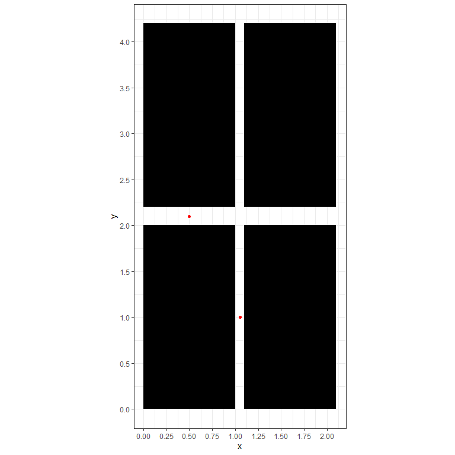

Klayout API Testing
================
Scott Alder
8/24/2021

Klayout API has built in methods for writing layout data to multiple
file formats. The main formats are, of course, \*.oas and \*.gds.
However, there is also the \*.dxf format, a generic CAD file format
developed by Autodesk (developer of the AutoCAD application). The
advantage of the \*.dxf format is that it’s generic, meaning that there
are open source libraries for working with \*.dxf files. In R, we can
use the `rgdal` package to read the layout data from a \*.dxf file. The
disadvantage is that the file compression isn’t nearly as good compared
to \*.oas and \*.gds, so expect file size to increase significantly.

Here’s a brief write-up in RMarkdown showing how to work with layout
data from RStudio.

You can install the Klayout python module from RStudio using the
`reticulate` package.

``` r
#### R Code Chunk ####
# NOT RUN
library(reticulate)
reticulate::py_install("klayout", pip=T)
```

Here’s some python code for making dummy layout data and saving it as a
\*.oas file.

``` python
#### Python Code Chunk ####
import pya # "pya" is the actual module name, not "klayout"

# Create dummy layout data
layout = pya.Layout()
top = layout.create_cell("TOP")
l1 = layout.layer(1, 0)

# Insert 4 rectangles into the layout
## pya.Box(left edge, bottom edge, right edge, top edge)
## Shape insertion coordinates are in nm, not um
top.shapes(l1).insert(pya.Box(0, 0, 1000, 2000)) 
top.shapes(l1).insert(pya.Box(0 + 1100, 0, 1000 + 1100, 2000))
top.shapes(l1).insert(pya.Box(0, 0 + 2200, 1000, 2000 + 2200)) 
top.shapes(l1).insert(pya.Box(0 + 1100, 0 + 2200, 1000 + 1100, 2000 + 2200))

# Save as *.oas file
layout.write("test.oas")
```

    ## <klayout.dbcore.Shape object at 0x000000002AB3D138>
    ## <klayout.dbcore.Shape object at 0x000000002AB3D228>
    ## <klayout.dbcore.Shape object at 0x000000002AB3D318>
    ## <klayout.dbcore.Shape object at 0x000000002AB3D408>
    ## <klayout.dbcore.Layout object at 0x0000000026202ED0>

Now convert the dummy layout data from \*.oas to \*.dxf.

``` python
#### Python Code Chunk ####
import pya
layout = pya.Layout.new()
layout.read("test.oas")
layout.write("test.dxf")
```

    ## <klayout.dbcore.LayerMap object at 0x000000002AB3D228>
    ## <klayout.dbcore.Layout object at 0x000000002AB3D138>

Load the `rgdal` package and define the path to our test.dxf file

``` r
#### R Code Chunk ####
# install.packages("rgdal")
library(rgdal)
layout_file <- "test.dxf"
```

Read the \*.dxf file and convert to tidy data.

The end result is a tidy data frame where each row corresponds to a
vertex, with the following columns:

-   x: vertex x coordinate
-   y: vertex y coordinate
-   order: vertex order within polygon
-   piece: not sure, I think this is used if you have multiple polygons
    per “group”
-   group: ID for polygon or group of polygons
-   id: ID for polygon or group of polygons

``` r
#### R Code Chunk ####
library(dplyr)
library(broom)
library(readr)
layout_data <- 
  rgdal::readOGR(layout_file) %>% # SpatialPointsDataFrame data structure is difficult to work with...
  broom::tidy() %>%     # BUT: RGDAL has built-in method to tidy the data structure 
  dplyr::rename(x=long, y=lat) # Our data is not geospatial

readr::write_csv(layout_data, "test.csv") # Save the tidy data to *.csv

head(layout_data) %>% # First 6 rows
  knitr::kable()
```

    ## OGR data source with driver: DXF 
    ## Source: "C:\Users\gscot\Desktop\klayout-api\klayout-api-testing\test.dxf", layer: "entities"
    ## with 4 features
    ## It has 6 fields

|   x |   y | order | piece | group | id  |
|----:|----:|------:|:------|:------|:----|
| 0.0 |   0 |     1 | 1     | 0.1   | 0   |
| 0.0 |   2 |     2 | 1     | 0.1   | 0   |
| 1.0 |   2 |     3 | 1     | 0.1   | 0   |
| 1.0 |   0 |     4 | 1     | 0.1   | 0   |
| 0.0 |   0 |     5 | 1     | 0.1   | 0   |
| 1.1 |   0 |     1 | 1     | 1.1   | 1   |

Now we can easily plot the layout data, or do some other kind of
analysis

``` r
#### R Code Chunk ####
library(ggplot2)
theme_set(theme_bw())
g <- 
  layout_data %>% 
  ggplot(aes(x, y, group=group)) +
  geom_polygon(fill="black", color=NA) +
  # Red pt's for bonus exercise below: taking auto CD measurements
  geom_point(
    aes(x, y), 
    data.frame(x=c(1.05, 0.5), y=c(1.0, 2.1)), 
    color="red", inherit.aes = FALSE
  ) +
  coord_fixed() +
  scale_x_continuous(n.breaks = 10) +
  scale_y_continuous(n.breaks = 10)

print(g)
```

<!-- -->

Bonus exercise: taking CD measurements of layout data at a list of
coordinates

You can measure the shortest CD at a point (x,y) in the layout by
inserting a “measure ruler annotation” into the `LayoutView` object and
then accessing the annotation’s attributes.

Unfortunately, this has to be done as a macro within Klayout. It can’t
be done from an external IDE due to the way `LayoutView` objects work.

Open a layout file (such as test.oas) and run this code in the internal
Klayout macro window

``` python
#### Python Code Chunk ####
# NOT RUN
import pya
import math

view = pya.LayoutView.current()

# Coordinates are in um
pt_array = [
  [1.05, 1.0], # Horizontal CD = 0.1um
  [0.5, 2.1]   # Vertical CD = 0.2um
]

cd_array = [] # Array for sotring output: x,y,CD,angle

for pt in pt_array:
  ant = view.create_measure_ruler(pya.DPoint.new(pt[0], pt[1]))

  dx = ant.p1.x - ant.p2.x
  dy = ant.p1.y - ant.p2.y 
  cd = (dx**2.0 + dy**2.0)**0.5
  
  if dx == 0:
    angle = 90
  else:
    angle = abs(math.atan(dy/dx))
  
  cd_array.append([pt[0], pt[1], round(cd, 4), round(angle, 4)]) 
  
print(cd_array) # Could write results to a file instead
```

However, it can also be done by running the Python script inside Klayout
from the command line without manually opening the Klayout GUI.

First, we will store the python code in `cd_measure_code`, a character
vector in the R environment.

``` r
#### R Code Chunk ####
library(glue)

# Code for python script in Klayout (same code as before  )
cd_measure_code <- 
glue::glue(
  "
import pya
import math

view = pya.LayoutView.current()

# Coordinates are in um
pt_array = [
  [1.05, 1.0], # Horizontal CD = 0.1um
  [0.5, 2.1]   # Vertical CD = 0.2um
]

cd_array = [] # Array for storing output: x,y,CD,angle

for pt in pt_array:
  ant = view.create_measure_ruler(pya.DPoint.new(pt[0], pt[1]))

  dx = ant.p1.x - ant.p2.x
  dy = ant.p1.y - ant.p2.y 
  cd = (dx**2.0 + dy**2.0)**0.5
  
  if dx == 0:
    angle = 90
  else:
    angle = abs(math.atan(dy/dx))
  
  cd_array.append([pt[0], pt[1], round(cd, 4), round(angle, 4)]) 
  
print(cd_array) # Could write results to a file instead"
)   
```

Next, save the code to a \*.py file in the temp directory

``` r
#### R Code Chunk ####
# Create *.py script in temp directory
tmp_py <- tempfile(fileext=".py")
writeLines(cd_measure_code, tmp_py)
```

Next, find the path to the Klayout executable

``` r
#### R Code Chunk ####
# Find path to klayout_app.exe
klayout_exe_path <-
  Sys.getenv("USERPROFILE") %>%
  paste0("\\AppData\\Roaming\\") %>%
  list.files("klayout_app.exe", recursive = T, full.names = T) %>%
  normalizePath()
```

Next, run the following on the command line and store the result in the
`cd_measurements` object:

`<path to klayout_app.exe> <path to layout file> -r <path to Python script>`

This will run the Python script inside Klayout.

The `-r` argument prevents the Klayout GUI from actually opening.

``` r
#### R Code Chunk ####
# Run script on the command line and capture output using `system(intern=TRUE)`
cd_measurements <- 
  paste(klayout_exe_path, "test.oas", "-r", tmp_py) %>% # -r prevents GUI from opening
  system(intern=TRUE) # System runs the command; intern=TRUE will save the output
```

Print the result and check if the CD’s are correct.

``` r
#### R Code Chunk ####
print(cd_measurements)
```

    ## [1] "[[1.05, 1.0, 0.1, 0.0], [0.5, 2.1, 0.2, 90]]"

At (x, y) = (1.05, 1.0) the script returned a CD of 0.1um with an angle
of 0.0 degrees (horizontal).

At (x, y) = (0.5, 2.1) the script returned a CD of 0.2um with an angle
of 90.0 degrees (vertical).
