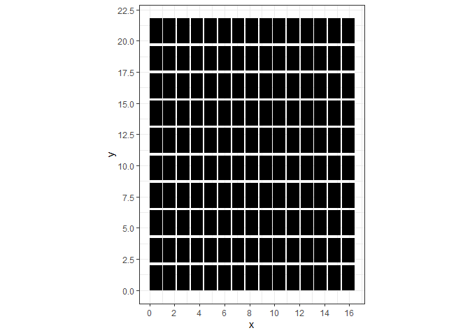
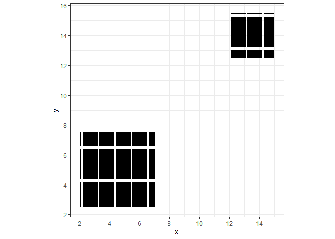
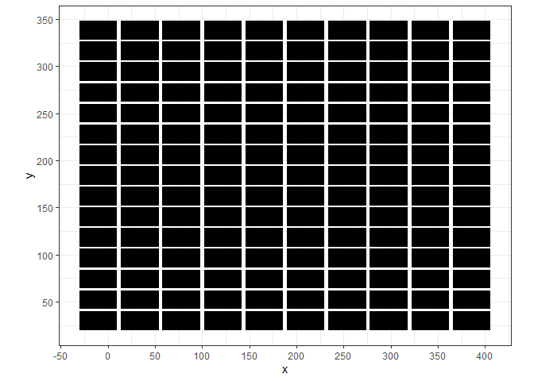

Other Klayout Functions
================
Scott Alder
8/24/2021

``` r
library(reticulate)
library(dplyr)
library(readr)
library(tidyr)
library(ggplot2)
library(rgdal)
library(broom)
```

# Create dummy data

``` python
#### Python Code Chunk ####
import pya # "pya" is the actual module name, not "klayout"

# Create dummy layout data
layout = pya.Layout()
top = layout.create_cell("TOP")
l1 = layout.layer(1, 0)

# Repetition
x_reps = [1,2,3,4,5,6,7,8,9,10,11,12,13,14,15]
y_reps = [1,2,3,4,5,6,7,8,9,10]
dims = [1000, 2000]
sep  = [100, 200]

for xr in x_reps:
  for yr in y_reps:
    top.shapes(l1).insert(
      pya.Box(
        0.0     + (xr - 1)*(sep[0] + dims[0]), # Left
        0.0     + (yr - 1)*(sep[1] + dims[1]), # Bottom
        dims[0] + (xr - 1)*(sep[0] + dims[0]), # Right
        dims[1] + (yr - 1)*(sep[1] + dims[1])  # Top
      )
    ) 
    
# Save as *.oas file
```

``` python
layout.write("test2.oas")
```

``` python
layout.write("test2.dxf")
```

``` r
#### R Code Chunk ####
layout_data <- 
  readOGR("test2.dxf") %>% 
  tidy() %>% 
  rename(x=long, y=lat)
```

    ## OGR data source with driver: DXF 
    ## Source: "C:\Users\gscot\Desktop\klayout-api\klayout-api-testing\test2.dxf", layer: "entities"
    ## with 150 features
    ## It has 6 fields

``` r
theme_set(theme_bw())
g <- 
  layout_data %>% 
  ggplot(aes(x, y, group=group)) +
  geom_polygon(fill="black", color=NA) +
  coord_fixed() +
  scale_x_continuous(n.breaks = 10) +
  scale_y_continuous(n.breaks = 10)

print(g)
```

<!-- -->

# Clipping

``` python
import pya
layout = pya.Layout.new()
layout.read("test2.oas")

top_cell = layout.cell("TOP")

bb_array = [
  pya.Box.new(2000, 2500, 7000, 7500),
  pya.Box.new(12000, 12500, 15000, 15500)
]

clipped_layout = pya.Layout.new()
clipped_layout.dbu = layout.dbu
for layer_id in layout.layer_indices():
  clipped_layout.insert_layer_at(layer_id, layout.get_info(layer_id))
  
clip_cells = layout.multi_clip_into(top_cell.cell_index(), clipped_layout, bb_array)  

clip_top_cell = clipped_layout.create_cell("TOP")  
for cc in clip_cells: 
  clip_top_cell.insert(pya.CellInstArray(cc, pya.Trans()))

clipped_layout.write("clipped_test2.oas")
clipped_layout.write("clipped_test2.dxf")
```

    ## <klayout.dbcore.LayerMap object at 0x000000002A7A5A98>
    ## <klayout.dbcore.Layout object at 0x000000002A7A5C78>
    ## <klayout.dbcore.Instance object at 0x000000002A7A5D68>
    ## <klayout.dbcore.Instance object at 0x000000002A7A5DE0>
    ## <klayout.dbcore.Layout object at 0x000000002A7A5C78>
    ## <klayout.dbcore.Layout object at 0x000000002A7A5C78>

``` r
theme_set(theme_bw())
g <- 
  readOGR("clipped_test2.dxf") %>% 
  tidy() %>% 
  rename(x=long, y=lat) %>% 
  ggplot(aes(x, y, group=group)) +
  geom_polygon(fill="black", color=NA) +
  coord_fixed() +
  scale_x_continuous(n.breaks = 10) +
  scale_y_continuous(n.breaks = 10)

print(g)
```

<!-- -->

    ## OGR data source with driver: DXF 
    ## Source: "C:\Users\gscot\Desktop\klayout-api\klayout-api-testing\clipped_test2.dxf", layer: "entities"
    ## with 2 features
    ## It has 6 fields

# Image capture

# Coordinate transformations

``` python
import pya
layout = pya.Layout.new()
layout.read("test2.oas")

# The sequence of operations is: magnification, mirroring at x axis,
#   rotation, application of displacement.
# @param mag The magnification
# @param rot The rotation angle in units of degree
# @param mirrx True, if mirrored at x axis
# @param x The x displacement
# @param y The y displacement
t = pya.CplxTrans.new(20.0, 90, True, -30.0, 20.0)

layout.transform(t.to_trans())

layout.write("trans_test2.dxf")
```

    ## <klayout.dbcore.LayerMap object at 0x000000002A7A5B10>
    ## <klayout.dbcore.Layout object at 0x000000002A7A1048>
    ## <klayout.dbcore.Layout object at 0x000000002A7A1048>

``` r
theme_set(theme_bw())
g <- 
  readOGR("trans_test2.dxf") %>% 
  tidy() %>% 
  rename(x=long, y=lat) %>% 
  ggplot(aes(x, y, group=group)) +
  geom_polygon(fill="black", color=NA) +
  coord_fixed() +
  scale_x_continuous(n.breaks = 10) +
  scale_y_continuous(n.breaks = 10)

print(g)
```

<!-- -->

    ## OGR data source with driver: DXF 
    ## Source: "C:\Users\gscot\Desktop\klayout-api\klayout-api-testing\trans_test2.dxf", layer: "entities"
    ## with 150 features
    ## It has 6 fields

# Import file/layer into current
